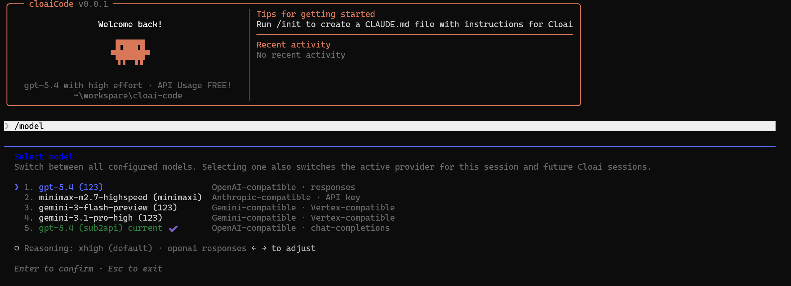

# cloaiCode

<div align="center">



# cloaiCode

**面向多 Provider 原生接入增强的代码助手 CLI。🚀**

专业、务实、可落地。适合需要稳定接入第三方模型、代理服务与自定义网关的开发环境。🚀

[](README.md)
[](README.md)
[](README.md)
[](README.md)

</div>

---

## ✨ 项目简介

`cloaiCode` 是一个面向实际开发场景持续演进的 CLI 分支。我们的核心目标不是停留在“表面兼容”，而是让**第三方模型接入、代理转发、自定义鉴权与非官方部署环境**真正做到可用、好用、易维护。

拒绝简单的外围套壳，摒弃对外部切换器的依赖，我们在原版代码的基础上直接深度扩展了**原生接入能力**。

**典型适用场景：**

  * 🖥️ 在本地终端中直接调用自定义模型与 Provider。
  * 🌐 通过 Anthropic 兼容网关或 OpenAI 兼容网关接入模型。
  * 🔐 无缝切换 API Key、OAuth 及不同 Provider 的专属鉴权模式。
  * 🧱 在无桌面环境（GUI）的服务器终端中高效完成配置与调用。
  * ⚙️ 统一集中管理配置、登录态与模型选择等行为至独立目录。

-----

## 🎯 核心痛点与解决方案

许多用户习惯通过 **CC Switch** 将第三方模型接入现有工具链，这固然可行；但 `cloaiCode` 更进一步，选择了体验更佳的**原生支持**。

**原生支持的不可替代性在于：**

  * ⚡ **链路更短，响应更快**：省去中间切换与转接层。
  * 🧭 **闭环体验，直截了当**：Provider 选择、鉴权与模型切换均在工具内部一站式完成。
  * 🛠️ **开箱即用，降低依赖**：无需额外部署切换器即可实现基础接入。
  * 🖥️ **完美契合无头环境**：在无屏幕终端、远程 SSH 或容器环境中配置极其便利。
  * 🔄 **配置统一，易于排障**：全局语义一致，问题定位更直观。

如果你的主力工作台是**云主机、跳板机、远程开发容器**或**无 GUI 的 Linux / Windows Server 终端**，这种“原生接入”将为你带来断崖式的体验提升。✅

-----

## 🚀 核心增强特性

相比上游版本，本项目目前重点重构并增强了以下能力：

### 1\. 原生多 Provider 接入

支持在程序内部直接配置并无缝切换不同的 Provider，彻底摆脱对外部切换层的依赖。

### 2\. 原生多鉴权模式隔离

针对不同 Provider，支持独立持久化存储其对应的鉴权方式。有效解决“相同 Provider 却被错误复用 authMode”的历史遗留问题。

### 3\. 自定义模型与列表管理

提供更便捷的非默认模型接入方案。支持轻松维护本地模型列表，并在交互进程中实现即时点选。

### 4\. 深度优化的 OpenAI 兼容协议

除了完善的 Anthropic 兼容路径外，本项目正在持续深化 OpenAI 侧的协议与路由能力，已支持：

  * Chat Completions
  * Responses
  * OAuth

### 5\. 独立配置目录与数据沙盒

默认采用 `~/.cloai` 作为全局配置根目录，从物理层面避免与其他同类工具发生配置、缓存或登录态的碰撞与污染。

-----

## ✅ 已验证模型

以下模型与接入路径的组合均已通过实际测试验证，开箱即用：

| 模型名称 | 接入协议 | 推理努力 (Reasoning) | 思维链显示 |
| :--- | :--- | :---: | :---: |
| `minimax-m2.7-highspeed` | Anthropic-like | √ | √ |
| `gpt-5.4` | OpenAI-like<br>*(支持 Chat Completions / Responses（推荐）/ OAuth)* | √ | √ |
| `gemini-3-flash-preview` | Gemini-like | - | √ |
| `gemini-3.1-pro-high` | Gemini-like | - | √ |

-----

## 🧩 数据隔离与配置管理

为了保证多环境下的稳定性，本项目将所有用户数据严格收口至：

  * **配置根目录**：`~/.cloai`
  * **全局配置文件**：`~/.cloai/.claude.json`

**架构收益：**

  * 杜绝历史登录态的互相污染。
  * 防止不同网关或 Provider 的 Endpoint 发生串联。
  * 确保模型列表、鉴权方式及缓存状态彼此独立。
  * 为多环境（开发/生产）提供极其便捷的独立配置与备份手段。

对于需要长期维护多套底层环境的开发者而言，这种物理隔离设计将显著降低日常排障成本。🧰

-----

## 📦 环境要求与安装

在开始之前，请确保本机环境满足以下前置依赖：

  * **Bun** \>= `1.3.5`
  * **Node.js** \>= `24`

### 安装依赖

```bash
bun install
```

**⚠️ 路径确认：**
请务必确认 Bun 的可执行目录已加入当前 shell 的 `PATH` 环境变量中。否则，执行 `bun link` 后 `cloai` 命令可能无法在全局生效。

```bash
export BUN_INSTALL="$HOME/.bun"
export PATH="$BUN_INSTALL/bin:$PATH"
```

可通过以下命令进行环境自检：

```bash
which bun
echo $PATH
```

-----

## 🛠️ 部署与使用方式

### 方式一：源码全局部署（推荐）

在仓库根目录依次执行：

```bash
bun install
bun link
```

部署完成后，即可在任意终端通过全局命令启动：

```bash
cloai
```

  * **包名**：`@cloai-code/cli`
  * **全局命令**：`cloai`

*(💡 排错指南：如果提示 `command not found`，通常是 `~/.bun/bin` 缺失于 `PATH` 中；如果提示找不到 `bun`，请检查入口脚本底部的 `#!/usr/bin/env bun` 解析路径是否正确。)*

### 方式二：作为 Link 包引入项目

将本 CLI 链接至全局：

```bash
bun link @cloai-code/cli
```

或在目标项目的 `package.json` 中直接引用：

```json
{
  "dependencies": {
    "@cloai-code/cli": "link:@cloai-code/cli"
  }
}
```

-----

## ▶️ 常用命令字典

  * **开发模式热启动**：`bun run dev`
  * **生产环境全局启动**：`cloai`
  * **查看当前版本号**：`bun run version`

-----

## 🔐 灵活的鉴权与登录体系

让登录与鉴权在复杂网络环境中变得更灵活，是本项目的设计核心之一。根据你选择的 Provider，支持以下鉴权策略：

### 1\. API Key 模式 (核心推荐)

  * **适用场景**：Anthropic 兼容服务、OpenAI 兼容服务、各类代理/网关及第三方模型中转平台。
  * **优势**：最稳定、最易于自动化集成。完美适配服务器、容器、远程终端等纯无头（Headless）环境。🔑

### 2\. OAuth 模式

  * **适用场景**：部分原生支持 OAuth 的 Provider 或特殊接入路径。
  * **优势**：当运行环境已具备相应图形化或浏览器回调条件时，可作为 API Key 的补充方案，允许你使用你的 Codex 额度或 Gemini CLI 额度。

### 3\. Provider 级独立鉴权沙盒

系统会对 **“Provider + authMode”** 的组合关系进行严格的持久化绑定。彻底终结以下痛点：

  * 切换 Provider 后错误沿用上一家的鉴权令牌。
  * 同一 Provider 下，不同鉴权模式的数据被互相覆盖。
  * 重启 CLI 后初始鉴权选项识别紊乱。

这对于需要频繁在多家大模型服务商之间横跳的重度用户而言，是一项至关重要的体验提升。🧠

-----

## 🧭 Provider 路由与选择指南

我们重构了 Provider 的选择逻辑，使其更加自然且意图明确。在实际配置中，你通常需要面对以下三个维度的选择：

### 1\. Anthropic 兼容线路

  * **目标场景**：自建网关、代理服务、第三方兼容平台，以及已验证的 `minimax-m2.7-highspeed` 接入。
  * **特点**：追求极致稳定与极简路径的首选。

### 2\. OpenAI 兼容线路

  * **目标场景**：提供 Chat Completions / Responses 标准接口的平台，接入 `gpt-5.4` 等核心模型，或需要兼容 OAuth 工作流的场景。

### 3\. 相同 Provider 的多路鉴权分化

即使是同一个 Provider，只要支持多种鉴权模式，`cloaiCode` 就会在底层将其处理为**相互独立的配置实体**，绝不进行粗暴的状态混合。
这使得“配置检查无误，但实际请求却走了错误鉴权通道”的诡异问题彻底成为历史。🔍

-----

## 🔄 深度 OpenAI 协议支持

本项目绝非仅仅在前端界面增加一个 `Base URL` 输入框，而是在底层网络层面对齐了更为完整的 OpenAI 协议规范。当前重点支持：

  * 全面接管 OpenAI Chat Completions 路由。
  * 全面接管 OpenAI Responses 路由。
  * 精准匹配相应的模型选择器与鉴权中间件。
  * 针对不同协议路径的智能请求转发与载荷适配。

将协议解析转化为 CLI 的“一等公民”能力，而非外围补丁，正是 `cloaiCode` 在多模型接入场景下远超传统外部切换方案的核心壁垒。🧱

-----

## 📚 推荐工作流

### 首次拉取与初始化

```bash
git clone <your-repo-url>
cd cloai-code
bun install
bun link
cloai
```

### 日常迭代与更新

```bash
git pull
bun install
bun link
cloai
```

这套标准工作流非常适合通过源码方式持续追踪上游更新的用户，也便于你随时在本地验证新模型、新 Provider 或新的底层协议支持。

-----

## 🖥️ 为什么它是服务器环境的理想选择？

在真实的服务器生产环境中，传统的“外部切换器 + 图形登录 + 多层转发”方案往往会暴露诸多短板：

  * 需额外引入并长期维护脆弱的切换组件。
  * 登录流程强依赖 GUI 环境或繁琐的跨端人工拷贝。
  * 配置文件散落在系统各处，排障链路极长。
  * 在纯 CLI 工具（如 SSH / tmux / Docker）中即时切换 Provider 体验割裂。

`cloaiCode` 坚持将核心操作收敛回 CLI 内部闭环，因此在以下场景中展现出压倒性的优势：

  * 纯无头 Linux 远程服务器
  * Windows Server Core 终端
  * WSL (Windows Subsystem for Linux)
  * Docker / Dev Container 开发容器
  * 基于 SSH 的极客运维流

一言以蔽之：**系统少一层转接折腾，运行就少一分不确定性。** 🧩

-----

## ⚠️ 免责与声明

  * 本项目为一个处于持续演进中的非官方分支，不代表任何官方立场。
  * 部分核心能力已在生产级场景验证稳定，但个别冷门协议与 Provider 适配仍在敏捷迭代中。
  * 如果你追求对第三方模型接入过程的“绝对掌控权”，这个项目方向将比“单纯复刻官方行为”释放出更大的定制价值。

-----

## 🙏 致谢

特别感谢 **doge-code** 项目及其作者提供的宝贵灵感与架构参考。他们在该领域的早期探索极具前瞻价值。

  * 参考项目：[https://github.com/HELPMEEADICE/doge-code.git](https://github.com/HELPMEEADICE/doge-code.git)

-----

## 📌 结语

`cloaiCode` 的核心护城河，绝不仅仅是“能连上第三方模型这么简单”，而是：

  * ✅ **原生重构**的多 Provider 核心。
  * ✅ **原生隔离**的多鉴权模式。
  * ✅ **原生解析**的多元协议路径。
  * ✅ **严谨验证**的关键模型组合矩阵。
  * ✅ **完美适配**的纯服务器与无屏幕终端基因。

如果你正在寻觅一个**更纯粹、更灵活、更能从容应对复杂网络与部署环境**的代码助手 CLI 方案，那么，欢迎使用 `cloaiCode`。🔥