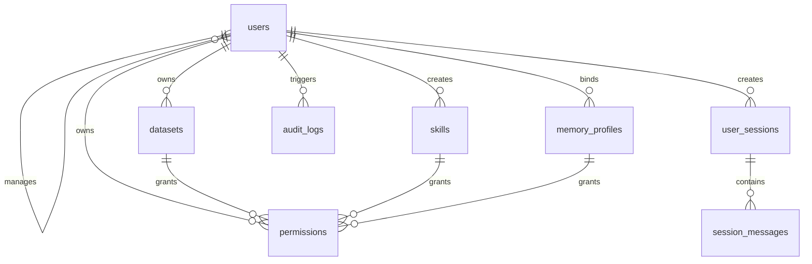

# cloai-code 统一治理实施规划（纯 TS 单项目版）

## 1. 背景与目标

### 1.1 背景

当前仓库 `cloai-code` 已具备 Agent 执行、工具调用、技能加载、会话与记忆能力，但治理能力尚未完整平台化，主要差距包括：

1. 服务端 RBAC 与组织管理能力不足。
2. 权限、审计、会话缺少统一数据主干。
3. 多用户隔离仍有本地单用户语义残留。
4. 运行时策略（授权、审计、熔断）缺少统一入口。

### 1.2 总体目标

本方案目标是将 `cloai-code` 建设为“可独立生产运行”的统一治理后端，最终形成：

1. 一套统一后端（TypeScript）。
2. 一套统一权限体系（RBAC + 资源授权）。
3. 一套统一审计与运维链路。
4. 一套多用户隔离的会话、记忆、技能治理体系。

### 1.3 非目标

1. 不做大规模无关平台化改造。
2. 不在初期重构所有历史前端页面。
3. 不追求一步到位，采用分阶段稳定落地。

## 2. 统一治理定义与范围

### 2.1 治理范围

1. 身份鉴权：登录、令牌签发、会话续期。
2. 权限控制：用户、角色、上下级、资源授权。
3. 资源治理：Dataset、Skill、MemoryProfile 的可见与可用边界。
4. 审计追踪：关键写操作与关键调用全链路可追溯。
5. 运维控制：健康检查、灰度开关、限流熔断、回滚策略（系统内）。

备注（用途详解）：

1. 身份鉴权用于确认“你是谁”，解决非法访问与会话伪造问题。
2. 权限控制用于确认“你能做什么”，解决越权调用和跨组织访问问题。
3. 资源治理用于确认“你能用哪些能力”，解决用户可见能力漂移问题。
4. 审计追踪用于确认“谁在何时做了什么”，用于合规审计和问题追踪。
5. 运维控制用于确认“系统在异常时如何自保”，保障线上稳定性。

### 2.2 统一原则

1. 默认拒绝：无授权即不可访问资源。
2. 上下文显式：每次请求必须携带 `userId`、`role`、`profileId`。
3. 策略先行：执行前先判权、再装配能力、后执行。
4. 审计强制：关键动作必须落审计，失败要有降级与告警。

## 3. 目标架构（TS 单后端）

### 3.1 分层设计

1. **治理层（Control Plane）**
   - JWT 鉴权与身份解析
   - 用户/角色/上下级关系管理
   - 资源授权与策略决策
   - 审计、运维、配置开关
2. **执行层（Execution Plane）**
   - 对话编排与工具调用
   - 记忆读写与会话管理
   - 技能装配与运行时约束

### 3.2 组件职责

1. `brain-server`：治理 API、权限决策、审计入库、上下文下发。
2. `cloai-code`：执行编排、工具/技能运行、按上下文做能力过滤。
3. PostgreSQL：主数据与审计存储。
4. Redis：会话缓存、授权缓存、限流计数。

备注（用途详解）：

1. `brain-server` 是治理真源，所有权限结果都以它返回为准。
2. `cloai-code` 是执行引擎，负责“执行动作”，不负责“放宽权限”。
3. PostgreSQL 用于持久化强一致数据，支持审计追责和离线分析。
4. Redis 用于低延迟读写场景，降低权限查询和会话访问延迟。

### 3.3 职责边界（强约束）

1. 鉴权与授权判定只在 `brain-server` 产生“最终结果”。
2. `cloai-code` 只消费上下文，不自行放宽权限。
3. 执行前必须获取 `brain/context`，缺失即拒绝执行。
4. 所有跨层调用必须传递 `trace_id`。

备注（用途详解）：

1. 该约束用于避免“执行层自行判权”导致策略分叉。
2. `brain/context` 是执行层唯一策略输入，缺失时拒绝是为了默认安全。
3. `trace_id` 用于串联接口调用、数据库审计与工具执行链路。

## 4. 数据模型规划

### 4.1 核心实体

1. `users`：账号主体（super_admin/admin/user）。
2. `permissions`：授权关系（按 `resource_type` 多态）。
3. `datasets`：数据集元信息。
4. `skills`：技能注册中心。
5. `memory_profiles`：用户记忆命名空间映射。
6. `user_sessions`：会话主表。
7. `session_messages`：会话消息明细。
8. `audit_logs`：通用审计流水。
9. `tool_call_audits`：工具调用审计（高频查询优化）。
10. `rag_query_audits`：RAG 查询审计（检索统计优化）。

备注（用途详解）：

1. `users` 用于表达组织身份与账号状态。
2. `permissions` 用于表达“用户-资源”的授权关系。
3. `datasets/skills` 用于表达可被授权与调用的能力资源。
4. `memory_profiles` 用于表达多用户记忆隔离边界。
5. `user_sessions/session_messages` 用于表达会话生命周期与消息轨迹。
6. `audit_logs/tool_call_audits/rag_query_audits` 用于表达治理审计与分析视图。

### 4.2 关键实体字段设计（建议）

1. `users`
   - 主键：`id`（bigint/uuid 二选一，建议 bigint 自增）
   - 字段：`username`（唯一）、`password_hash`、`role`、`manager_user_id`、`status`、`created_at`、`updated_at`
   - 约束：
     - `role in ('super_admin','admin','user')`
     - `user` 必须有 `manager_user_id`
     - `admin/super_admin` 的 `manager_user_id` 必须为 `null`
   - 字段用途说明：
     - `id`：内部主键，供所有关联表引用，建议不可变。
     - `username`：登录与展示账号，需全局唯一。
     - `password_hash`：口令密文，不允许存储明文密码。
     - `role`：角色边界标识，驱动 RBAC 判定。
     - `manager_user_id`：组织归属标识，限定 admin 管辖范围。
     - `status`：账号状态（active/disabled），用于快速封禁与停用。
     - `created_at/updated_at`：审计时间戳，支持追踪变更。
2. `permissions`
   - 主键：`id`
   - 字段：`user_id`、`resource_type`、`resource_id`、`granted_by`、`created_at`
   - 唯一约束：`(user_id, resource_type, resource_id)`
   - 资源类型建议：`DATASET`、`DATASET_OWNER`、`SKILL`、`MEMORY_PROFILE`
   - 字段用途说明：
     - `user_id`：被授权主体用户。
     - `resource_type`：资源类别，决定 `resource_id` 的解释方式。
     - `resource_id`：目标资源主键值。
     - `granted_by`：授权操作人，支持责任追溯。
     - `created_at`：授权生效时间，支持授权时序回放。
3. `datasets`
   - 主键：`id`（本地 id） + `external_dataset_id`（RagFlow id）
   - 字段：`name`、`owner_user_id`、`status`、`created_at`、`updated_at`
   - 字段用途说明：
     - `id`：本地治理主键。
     - `external_dataset_id`：外部系统映射键，避免外部 ID 漂移造成错配。
     - `owner_user_id`：资源归属人，用于管理授权与回收。
     - `status`：资源状态（online/offline/deleted），用于安全下线流程。
4. `skills`
   - 主键：`id`（本地 id） + `tool_code`（唯一）
   - 字段：`tool_name`、`description`、`schema_json`、`status`、`created_by`、`updated_by`、`created_at`、`updated_at`
   - 字段用途说明：
     - `tool_code`：技能唯一编码，执行层按该编码装配能力。
     - `tool_name`：管理端展示名称。
     - `schema_json`：参数契约定义，供入参校验与 UI 生成。
     - `status`：技能状态，支持快速禁用高风险技能。
     - `created_by/updated_by`：配置责任人，满足审计要求。
5. `memory_profiles`
   - 主键：`id`
   - 字段：`profile_id`（唯一）、`user_id`（唯一）、`storage_root`、`created_at`、`updated_at`
   - 说明：确保“一人一个主 profile”；后续可扩展“一人多 profile”
   - 字段用途说明：
     - `profile_id`：执行层隔离主键，目录和缓存均依赖该值。
     - `user_id`：与用户绑定关系，一版为一对一。
     - `storage_root`：存储根目录，支持本地或对象存储抽象。
6. `user_sessions`
   - 主键：`id`
   - 字段：`session_id`（唯一，业务会话号）、`user_id`、`profile_id`、`title`、`status`、`last_message_at`、`created_at`
   - 字段用途说明：
     - `session_id`：业务会话唯一号，对外接口优先使用该字段。
     - `user_id`：会话归属用户。
     - `profile_id`：会话归属命名空间，防止跨用户串读。
     - `last_message_at`：最近活跃时间，用于列表排序与归档策略。
7. `session_messages`
   - 主键：`id`
   - 字段：`session_id`、`user_id`、`role`、`content`、`token_usage_json`、`created_at`
   - 索引：`(session_id, created_at)` 复合索引
   - 字段用途说明：
     - `role`：消息角色（system/user/assistant/tool）。
     - `content`：消息正文，可按策略做脱敏与裁剪。
     - `token_usage_json`：模型调用成本与用量统计。
8. `audit_logs`
   - 主键：`id`
   - 字段：`trace_id`、`user_id`、`operator_id`、`action`、`resource_type`、`resource_id`、`result`、`payload_json`、`created_at`
   - 索引：`trace_id`、`(user_id, created_at)`、`(action, created_at)`
   - 字段用途说明：
     - `trace_id`：全链路跟踪键，排障检索首选。
     - `user_id`：行为主体（谁受影响）。
     - `operator_id`：操作主体（谁发起动作）。
     - `action`：动作类型（grant/revoke/login/update 等）。
     - `result`：执行结果（success/deny/fail）。
     - `payload_json`：补充上下文，建议脱敏后存储。

### 4.3 实体关系（ER）



关系语义：

1. `users.manager_user_id -> users.id`（同表自关联，admin 管 user）。
2. `permissions.user_id -> users.id`（授权对象）。
3. `permissions.resource_id -> datasets/skills/memory_profiles`（按 `resource_type` 多态关联）。
4. `user_sessions.user_id -> users.id`，`session_messages.session_id -> user_sessions.session_id`。
5. `audit_logs.user_id/operator_id -> users.id`（行为主体与操作主体分离）。

备注（用途详解）：

1. `manager_user_id` 自关联用于表达组织边界，不建议由前端直接可写。
2. `permissions` 多态关联用于统一授权模型，但需要应用层做一致性校验。
3. `session_messages` 关联 `session_id`（业务键）便于跨服务对齐。
4. `user_id` 与 `operator_id` 分离是审计合规的核心要求。

### 4.4 权限语义与管理边界

1. `super_admin`
   - 可管理所有 `users`、`datasets`、`skills`、`permissions`。
2. `admin`
   - 仅可管理“自己 + 直属 user”（由 `manager_user_id` 判定）。
3. `user`
   - 仅可访问自身 `profile`、`session`、已授权 `dataset/skill`。
4. 统一原则
   - 任何资源访问先过 `permissions` 校验。
   - 无授权默认拒绝（deny by default）。

备注（用途详解）：

1. `super_admin` 负责全局治理，不参与日常用户执行链路。
2. `admin` 负责组织内管理，不能突破 `manager_user_id` 边界。
3. `user` 仅消费授权结果，不具备管理能力。
4. 默认拒绝策略用于避免“新增资源默认暴露”的安全事故。

### 4.5 索引与性能建议

1. `users`
   - `uk_users_username(username)`
   - `idx_users_role(role)`
   - `idx_users_manager(manager_user_id)`
2. `permissions`
   - `uk_perm_user_type_res(user_id, resource_type, resource_id)`
   - `idx_perm_user(user_id)`
   - `idx_perm_res(resource_type, resource_id)`
3. `user_sessions`
   - `uk_sessions_sid(session_id)`
   - `idx_sessions_user_last(user_id, last_message_at desc)`
4. `session_messages`
   - `idx_messages_session_time(session_id, created_at)`
5. `audit_logs`
   - `idx_audit_trace(trace_id)`
   - `idx_audit_user_time(user_id, created_at)`
   - `idx_audit_action_time(action, created_at)`

备注（用途详解）：

1. `permissions` 的唯一索引保证同一授权不会重复写入。
2. `session_messages` 时间索引用于消息分页与回放。
3. `audit_logs` 三类索引分别覆盖排障、用户审计、动作统计三种查询路径。

### 4.6 级联与数据生命周期策略

1. 删除 `user`
   - 逻辑删除优先（`status=disabled`），避免历史审计断链。
2. 删除 `session`
   - 可物理删除 `session_messages`（按 `session_id` 级联）。
3. 删除 `dataset/skill`
   - 先软下线，再清理 `permissions`，最后执行外部资源回收。
4. 审计表
   - 不允许物理删除，仅支持归档（按月分区或冷存储）。

备注（用途详解）：

1. 用户逻辑删除用于保留历史责任链，满足审计与合规需求。
2. 会话允许物理删除是为了控制成本，但需保留操作审计记录。
3. 资源软下线优先是为了避免执行链路在切换期出现悬挂引用。

### 4.7 目录命名空间（cloai-code）

统一目录：

1. `profiles/<profileId>/sessions`
2. `profiles/<profileId>/memory`
3. `profiles/<profileId>/skills`
4. `profiles/<profileId>/credentials`

统一要求：

1. 文件、缓存键、临时目录都必须带 `profileId` 前缀。
2. 未绑定 `profileId` 的读写一律拒绝。
3. 迁移阶段采用“读旧写新”，并记录迁移审计。

备注（用途详解）：

1. `profileId` 是多用户隔离最小单元，必须贯穿文件系统和缓存系统。
2. “读旧写新”用于平滑迁移，避免一次性中断历史会话。
3. 迁移审计用于定位数据丢失与回放失败问题。

## 5. 接口规划（V1）

### 5.1 鉴权与用户

1. `POST /api/v1/auth/login`
2. `POST /api/v1/auth/refresh`
3. `GET /api/v1/auth/me`
4. `POST /api/v1/admin/users`
5. `PATCH /api/v1/admin/users/{id}`

接口用途详解：

1. `POST /api/v1/auth/login`
   - 用途：账号登录并签发访问令牌。
   - 入参：`username`、`password`。
   - 出参：`accessToken`、`refreshToken`、`expiresIn`、`user`。
   - 备注：失败返回统一错误码，禁止暴露“用户名不存在/密码错误”细分信息。
2. `POST /api/v1/auth/refresh`
   - 用途：刷新访问令牌，减少重复登录。
   - 入参：`refreshToken`。
   - 出参：新 `accessToken`、`expiresIn`。
   - 备注：刷新令牌需支持失效与轮换策略。
3. `GET /api/v1/auth/me`
   - 用途：获取当前登录态与角色信息。
   - 鉴权：必须携带有效 `accessToken`。
   - 出参：`id`、`username`、`role`、`status`、`profileId`。
4. `POST /api/v1/admin/users`
   - 用途：创建用户或下属账号。
   - 鉴权：`admin/super_admin`。
   - 备注：需校验 `manager_user_id` 合法性。
5. `PATCH /api/v1/admin/users/{id}`
   - 用途：更新用户状态、角色、归属关系。
   - 鉴权：`admin/super_admin`，且受管辖边界限制。

### 5.2 权限与上下文

1. `GET /api/v1/brain/context`
   - 返回：`role`、`profileId`、`allowedDatasets`、`allowedSkills`、`policyVersion`
2. `POST /api/v1/admin/permissions/datasets`
3. `POST /api/v1/admin/permissions/skills`
4. `GET /api/v1/admin/users/{id}/permissions`

接口用途详解：

1. `GET /api/v1/brain/context`
   - 用途：为执行层返回当前用户可用策略快照。
   - 出参：`role`、`profileId`、`allowedDatasets`、`allowedSkills`、`policyVersion`。
   - 备注：执行前必须调用，缓存需基于 `policyVersion` 失效。
2. `POST /api/v1/admin/permissions/datasets`
   - 用途：授予或撤销数据集访问权限。
   - 入参：`userId`、`datasetIds`、`action(grant|revoke)`。
3. `POST /api/v1/admin/permissions/skills`
   - 用途：授予或撤销技能调用权限。
   - 入参：`userId`、`skillIds`、`action(grant|revoke)`。
4. `GET /api/v1/admin/users/{id}/permissions`
   - 用途：查看某用户当前权限快照。
   - 备注：管理端权限页和排障页依赖该接口。

### 5.3 会话与记忆

1. `GET /api/v1/memory/self`
2. `PUT /api/v1/memory/self`
3. `GET /api/v1/sessions`
4. `GET /api/v1/sessions/{id}`

接口用途详解：

1. `GET /api/v1/memory/self`
   - 用途：读取当前用户记忆配置与摘要。
   - 备注：仅允许访问 `profileId` 对应数据。
2. `PUT /api/v1/memory/self`
   - 用途：更新当前用户记忆配置。
   - 备注：写入前需审计，写入后需触发缓存失效。
3. `GET /api/v1/sessions`
   - 用途：分页查询会话列表。
   - 支持：按时间范围、状态、关键词过滤。
4. `GET /api/v1/sessions/{id}`
   - 用途：查询单会话详情与消息流。
   - 备注：需校验会话归属用户与 `profileId` 一致。

### 5.4 审计与运维

1. `GET /api/v1/admin/audits`
2. `GET /api/v1/admin/audits/skills`
3. `GET /api/v1/admin/audits/rag`
4. `GET /api/health`
5. `GET /api/ready`

接口用途详解：

1. `GET /api/v1/admin/audits`
   - 用途：统一审计查询入口。
   - 支持：按 `trace_id/user_id/action/time_range` 过滤。
2. `GET /api/v1/admin/audits/skills`
   - 用途：技能调用审计查询，用于高频问题定位。
3. `GET /api/v1/admin/audits/rag`
   - 用途：RAG 检索审计与效果统计。
4. `GET /api/health`
   - 用途：进程级健康检查（服务是否存活）。
5. `GET /api/ready`
   - 用途：依赖级就绪检查（数据库/缓存/外部依赖是否可用）。
   - 备注：容器编排探针应优先使用该接口。

## 6. 分阶段实施计划（纯 TS）

### Phase 0：设计冻结（当前周）

1. 冻结实体、约束、接口、角色边界。
2. 冻结上下文字段与审计字段标准。
3. 输出实施任务拆分与验收口径。

**里程碑**：形成可直接开发的治理基线文档。

### Phase 1：治理骨架（第 1-2 周）

1. 搭建 `brain-server` 工程骨架。
2. 接入 Prisma + PostgreSQL + Redis。
3. 实现 `health/ready/login/me` 基础接口。

**里程碑**：服务可启动、可登录、可连库、可健康检查。

### Phase 2：权限主干（第 3-4 周）

1. 实现 `users/permissions/memory_profiles` 主流程。
2. 落地 `deny by default` 与上下级边界校验。
3. 产出 `brain/context` 并提供策略版本号。

**里程碑**：任意请求可得到确定的可用资源集合。

### Phase 3：执行层治理接入（第 5-6 周）

1. `cloai-code` 执行前强制拉取 `brain/context`。
2. 会话/记忆/技能目录全量切换到 `profiles/<profileId>`。
3. 补齐旧目录兼容读取与迁移脚本。

**里程碑**：多用户隔离生效，跨用户不可见。

### Phase 4：审计闭环与管理端（第 7-8 周）

1. 打通管理端授权配置与审计查询。
2. 强制关键动作审计中间件。
3. 补齐 `trace_id/tool_call_id` 链路透传。

**里程碑**：管理端可配置、可追溯、可核查。

### Phase 5：稳定性与灰度（第 9-10 周）

1. 按用户组灰度开启统一治理策略。
2. 引入熔断、限流、降级开关。
3. 达标后全量启用治理策略。

**里程碑**：纯 TS 单系统稳定承载全量流量。

## 7. 验收标准（上线门槛）

1. 权限一致：`super_admin/admin/user` 边界与设计一致。
2. 管辖有效：`admin` 无法操作非直属用户。
3. 资源授权有效：无授权用户无法调用目标 Dataset/Skill。
4. 隔离有效：会话、记忆、技能配置不串读。
5. 审计完整：关键动作可按 `user_id/trace_id` 追溯。
6. 性能达标：核心接口 P95、错误率满足基线。
7. 可降级：审计异常、外部资源异常时有受控降级策略。

## 8. 风险清单与控制

1. **权限语义漂移**
   - 控制：输出权限判定真值表并在 CI 中回归。
2. **数据一致性风险**
   - 控制：迁移脚本可重放、对账任务日常化、失败可补偿。
3. **执行链路抖动**
   - 控制：灰度开关、超时熔断、流量分组观测。
4. **审计落库失败**
   - 控制：分级策略（阻断写操作/降级只读）+ 告警通知。

## 9. Docker 部署与启动规范

### 9.1 新增目录

1. `brain-server/`
2. `deploy/docker-compose-brain-ts.yml`
3. `.env.brain.example`

### 9.2 端口规划

1. `brain-server`：`8091:8091`
2. `brain-postgres`：`5433:5432`
3. `brain-redis`：`6380:6379`

### 9.3 启动命令

1. 首次启动：`docker compose -f deploy/docker-compose-brain-ts.yml up -d --build`
2. 常规启动：`docker compose -f deploy/docker-compose-brain-ts.yml up -d`
3. 查看状态：`docker compose -f deploy/docker-compose-brain-ts.yml ps`
4. 查看日志：`docker compose -f deploy/docker-compose-brain-ts.yml logs -f brain-server`
5. 停止服务：`docker compose -f deploy/docker-compose-brain-ts.yml down`

## 10. 待确认决策（必须补齐）

1. 鉴权载荷字段与过期策略（Access/Refresh）。
2. `permissions` 多态关联的数据一致性校验方案。
3. 审计失败时的阻断级别（写阻断/软失败）。
4. 缓存失效策略与权限变更实时性目标。
5. 性能基线目标（P95、QPS、错误率）。

## 11. 跟进记录模板（后续持续追加）

```markdown
## 迭代记录 YYYY-MM-DD

- 目标：
- 变更范围：
- 关键文件：
- 接口影响：
- 风险与处理：
- 验证结果：
- 下步计划：
```

## 12. 当前决策（2026-04-09）

1. 采用纯 TS 单项目统一治理路线，不再以 Java 迁移为前提。
2. 先治理后执行，先做权限与数据主干，再做体验层扩展。
3. 采用分阶段灰度策略，配套熔断与降级，不依赖旧系统回切。

## 13. 两周落地清单（可直接执行）

1. 创建 `brain-server` 最小骨架（建议 Fastify + Prisma）。
2. 落地 `User/Permission/MemoryProfile` 三个首批模型与迁移。
3. 实现 `/api/health`、`/api/v1/auth/login`、`/api/v1/brain/context`。
4. 在 `cloai-code` 执行入口增加 `brain/context` 前置拉取与本地缓存。
5. 建立第一版审计中间件并串联 `trace_id`。

## 14. 任务规划与划分（不含人天）

### 14.1 阶段任务拆分原则

1. 每个任务必须有明确输入、输出、验收标准。
2. 每个阶段结束必须可独立验证，不依赖下一阶段兜底。
3. 优先建设“治理主干”，再改造“执行链路”。

### 14.2 Phase 0 设计冻结任务包

1. 治理契约冻结
   - 输入：本规划文档。
   - 输出：字段字典、错误码字典、鉴权载荷规范。
   - 验收：评审后无关键字段歧义。
2. 接口契约冻结
   - 输入：第 5 章接口清单。
   - 输出：OpenAPI 草案（V1）。
   - 产物文件：`programDoc/brain-server-openapi-v1-draft.yaml`
   - 验收：接口入参/出参/鉴权说明完整。
3. 审计契约冻结
   - 输入：审计字段与链路要求。
   - 输出：审计动作清单（必须审计/可选审计）。
   - 验收：关键写操作覆盖率 100%。

### 14.3 Phase 1 治理骨架任务包

1. 服务骨架
   - 任务：初始化 `brain-server`（路由、中间件、配置、健康检查）。
   - 输出：`/api/health`、`/api/ready` 可用。
2. 数据底座
   - 任务：接入 Prisma + PostgreSQL + Redis。
   - 输出：首批迁移脚本、数据库可启动、连接池可用。
   - 产物文件：`programDoc/brain-server-prisma-schema-draft.prisma`（迁移前基线草案）。
3. 身份主链
   - 任务：`login/refresh/me` 与 JWT 中间件。
   - 输出：可签发并验证令牌，支持基础过期策略。
4. 验收任务
   - 任务：容器启动、数据库连通、缓存连通、鉴权冒烟。
   - 输出：启动验收记录。

### 14.4 Phase 2 权限主干任务包

1. 用户与组织边界
   - 任务：`users` CRUD + `manager_user_id` 边界校验。
   - 输出：`admin` 仅可管理直属用户。
2. 授权主链
   - 任务：`permissions` 授权/撤权流程。
   - 输出：`dataset/skill` 授权生效可验证。
3. 上下文快照
   - 任务：实现 `GET /api/v1/brain/context`。
   - 输出：返回 `role/profileId/allowedDatasets/allowedSkills/policyVersion`。
4. 验收任务
   - 任务：越权访问回归、默认拒绝回归、授权缓存失效回归。
   - 输出：权限回归报告。

### 14.5 Phase 3 执行层接入任务包

1. 上下文前置校验
   - 任务：执行入口前置拉取 `brain/context`。
   - 输出：上下文缺失时拒绝执行。
2. 命名空间切换
   - 任务：会话/记忆/技能目录切换到 `profiles/<profileId>/...`。
   - 输出：跨用户隔离生效。
3. 兼容迁移
   - 任务：读旧写新 + 迁移脚本 + 迁移审计。
   - 输出：历史数据可读取、新数据按新目录落盘。
4. 验收任务
   - 任务：跨账号串读测试、迁移可重放测试。
   - 输出：隔离验证报告。

### 14.6 Phase 4 审计闭环任务包

1. 审计中间件
   - 任务：关键动作统一打点与落库。
   - 输出：`audit_logs/tool_call_audits/rag_query_audits` 可查询。
2. 链路标识
   - 任务：全链路透传 `trace_id/tool_call_id`。
   - 输出：一次请求可串联接口、工具、数据库审计记录。
3. 查询与运营
   - 任务：审计查询接口条件过滤与分页。
   - 输出：可按用户、动作、时间窗检索。
4. 验收任务
   - 任务：审计失败降级策略回归。
   - 输出：审计可用性报告。

### 14.7 Phase 5 稳定性与上线任务包

1. 灰度与开关
   - 任务：按用户组灰度启用统一治理。
   - 输出：开关可控，支持分批放量。
2. 稳定性策略
   - 任务：限流、超时、熔断、降级策略。
   - 输出：异常场景可自动保护核心链路。
3. 性能达标
   - 任务：关键接口压测与指标校验。
   - 输出：P95、错误率、拒绝率达到基线。
4. 上线验收
   - 任务：全量验收清单走查。
   - 输出：上线结论与遗留项清单。

## 15. 现有架构不符合项与整改建议（持续更新）

### 15.1 不符合项清单（当前已识别）

1. **系统形态不一致**
   - 现状：项目主入口是 CLI/TUI，不是治理 API 服务。
   - 影响：无法直接承载 `/api/v1/*` 治理接口。
   - 整改：新增 `brain-server` 作为治理层服务，CLI 保持执行层角色。
2. **持久化形态不一致**
   - 现状：会话主存储是本地 `jsonl` 文件。
   - 影响：难以实现多用户强隔离、统一审计检索、服务端并发治理。
   - 整改：以 PostgreSQL 为主存储，`jsonl` 转为兼容层与迁移输入。
3. **权限模型不一致**
   - 现状：已有工具权限与命令过滤，但缺少服务端 RBAC 真源。
   - 影响：执行层可见性与治理层授权难以统一。
   - 整改：权限结果统一由 `brain-server` 下发，执行层只消费。
4. **接口层缺失**
   - 现状：仓库中缺少成体系的 REST 鉴权/授权/审计路由层。
   - 影响：管理端与外部系统无法稳定对接。
   - 整改：按第 5 章先落地 V1 核心接口，再扩展管理面。
5. **依赖栈缺失**
   - 现状：未形成 `Prisma + PostgreSQL + Redis` 的治理运行主干。
   - 影响：数据一致性、缓存策略、授权实时性目标无法达成。
   - 整改：Phase 1 完成基础依赖接入与迁移脚本。
6. **恢复态代码完整性风险**
   - 现状：启动链路存在“缺失相对导入时仅进入恢复提示模式”的机制。
   - 影响：直接在现仓库上推进治理实现时，可能遇到非业务逻辑阻塞。
   - 整改：并行维护“恢复完整性清单”，优先清理阻断 `brain-server` 构建/运行的缺失项。

### 15.2 架构对齐检查点（每阶段复核）

1. 是否出现“执行层自行判权”代码路径。
2. 是否出现“未携带 profileId 的读写”代码路径。
3. 是否出现“关键写操作未落审计”代码路径。
4. 是否出现“权限变更后缓存未失效”问题。
5. 是否出现“接口契约与数据模型字段不一致”问题。

### 15.3 触发式提示机制（遇到即升级处理）

1. 新增资源默认可访问：立即阻断上线，回归默认拒绝策略。
2. 跨用户会话可见：立即标记 P0，冻结相关发布。
3. 审计落库失败无告警：立即补告警并启用降级策略。
4. 授权变更延迟超阈值：立即复核缓存策略与失效机制。
5. 恢复态缺失依赖阻断构建：立即转入“恢复阻断项清理”分支，暂停新增功能开发。

## 16. 实施准备产物（已产出）

1. OpenAPI 草案（V1）：`programDoc/brain-server-openapi-v1-draft.yaml`
2. Prisma schema 草案：`programDoc/brain-server-prisma-schema-draft.prisma`
3. 说明：上述产物为“契约冻结版本”，进入开发前应做一次评审并打上版本标签。
4. 项目进度总览：`programDoc/project-progress-tracker-zh.md`（用于统一跟踪 Done/InProgress/Todo）。

## 17. 当前推进状态（2026-04-09）

### 17.1 已完成

1. 新增 `brain-server` 最小工程骨架（Fastify + TypeScript）。
2. 已落地接口：
   - `GET /api/health`
   - `GET /api/ready`
3. 已提供运行基础文件：
   - `brain-server/package.json`
   - `brain-server/tsconfig.json`
   - `brain-server/.env.example`
   - `brain-server/src/config.ts`
   - `brain-server/src/server.ts`
   - `brain-server/src/index.ts`
4. 本地验证结果：
   - `bun install` 成功
   - `bun run build` 成功

### 17.2 新识别不符合项

1. **工作区编排未统一**
   - 现状：`brain-server` 已创建，但尚未纳入仓库统一启动脚本。
   - 影响：当前只能手动进入子目录运行，无法与主项目一键联调。
   - 处理：后续补充根目录 workspace 脚本或 `Makefile`/统一命令入口。
2. **治理接口仍是最小占位**
   - 现状：只落地 `health/ready`，尚未接入鉴权、权限、审计主链。
   - 影响：尚不具备治理能力，只是可运行骨架。
   - 处理：按 Phase 1 顺序继续实现 `auth/login/refresh/me` 与中间件。
3. **就绪检查尚未真实探测依赖**
   - 现状：`/api/ready` 暂以配置存在性作为占位检查。
   - 影响：无法真实反映 PostgreSQL/Redis 可用性。
   - 处理：接入真实连接探测与超时控制。
4. **认证用户源未接数据库**
   - 现状：`auth/login/refresh/me` 当前使用环境变量启动账号（bootstrap admin）。
   - 影响：不满足多用户与 RBAC 正式治理要求。
   - 处理：Phase 2 切换为 `users` 表校验，密码改为 `password_hash`，并移除明文启动账号。

### 17.3 Docker 启动与测试结果（已验证）

1. 使用编排文件：`deploy/docker-compose-brain-ts.yml`
2. 启动命令：`docker compose -f deploy/docker-compose-brain-ts.yml up -d --build`
3. 状态验证：`docker compose -f deploy/docker-compose-brain-ts.yml ps`
4. 接口验证：
   - `curl http://127.0.0.1:8091/api/health` 返回 `status=ok`
   - `curl http://127.0.0.1:8091/api/ready` 返回 `status=ok`
5. 日志验证：`docker compose -f deploy/docker-compose-brain-ts.yml logs --tail=80 brain-server`
6. 认证链路验证：
   - `POST /api/v1/auth/login` 返回 `accessToken/refreshToken`
   - `GET /api/v1/auth/me` 可读取当前用户上下文
   - `POST /api/v1/auth/refresh` 可刷新访问令牌

### 17.4 启动加速策略（环境缓存）

1. Docker 构建缓存：
   - `brain-server/Dockerfile` 先复制 `package.json + bun.lock` 再安装依赖，提升层缓存命中率。
   - 使用 BuildKit cache mount 缓存 Bun 包下载目录，加速重建。
2. 运行时持久卷缓存：
   - `brain_postgres_data` 持久化数据库，避免重复初始化。
   - `brain_redis_data` 持久化 Redis AOF，减少冷启动重建成本。
3. 镜像复用建议：
   - 代码未改动时使用 `docker compose -f deploy/docker-compose-brain-ts.yml up -d`，不重复 build。
4. 配置缓存建议：
   - 本地仅维护 `.env.brain`，模板使用 `.env.brain.example`，避免每次启动重复配置。

### 17.5 当前代码状态（2026-04-09 更新）

1. 已实现接口：
   - `GET /api/health`
   - `GET /api/ready`（真实探测 PostgreSQL/Redis）
   - `POST /api/v1/auth/login`
   - `POST /api/v1/auth/refresh`
   - `GET /api/v1/auth/me`
   - `POST /api/v1/admin/users`
   - `PATCH /api/v1/admin/users/{id}`
2. 实现方式说明：
   - 当前认证链路用于 Phase 1 先打通接口闭环，采用 bootstrap admin 账号。
   - 后续必须迁移到数据库用户体系，避免明文凭据长期存在。

### 17.6 Prisma 接入进展（2026-04-09 更新）

1. 已接入 Prisma：
   - `brain-server/prisma/schema.prisma`
   - `brain-server/prisma/migrations/20260409_init_users/migration.sql`
2. 已落地首批实体：
   - `users`（含 `role/status/manager_user_id` 约束）
3. 已落地启动链路：
   - 容器启动时执行 `prisma migrate deploy`
   - 执行 `seedAdmin` 保障首个管理账号存在
4. 已完成认证切换：
   - `auth/login` 由数据库 `users` 表校验
   - 密码校验使用 `bcrypt` 哈希对比，不再使用明文内置账号
5. Docker 可靠性修复：
   - 修复 `@prisma/client did not initialize yet`（改为复用 build 阶段已生成的 `node_modules`）
   - 镜像安装 `openssl`，消除 Prisma 运行期告警

### 17.7 当前仍不符合项（持续跟踪）

1. **组织边界校验未接入管理接口**
   - 状态：已完成（`admin/users` 创建与更新已接入“自己 + 直属 user”边界校验）。
   - 说明：下一步重点转到审计主链落地与权限资源类型扩展。

### 17.8 admin/users 边界回归结果（2026-04-09）

1. `super_admin` 可创建 `admin`（验证通过）。
2. `admin` 创建 `admin` 被拒绝（403，验证通过）。
3. `admin` 可创建 `user`，且默认 `manager_user_id` 绑定为自己（验证通过）。
4. `admin` 可更新直属 `user`（验证通过）。
5. `admin` 更新 `super_admin` 被拒绝（403，验证通过）。

### 17.9 permissions + context 进展（2026-04-09）

1. 已实现权限写入接口：
   - `POST /api/v1/admin/permissions/datasets`（`datasetIds`）
   - `POST /api/v1/admin/permissions/skills`（`skillIds`）
2. 已实现权限查询接口：
   - `GET /api/v1/admin/users/{id}/permissions`
3. 已实现上下文聚合接口：
   - `GET /api/v1/brain/context`
   - 返回 `allowedDatasets/allowedSkills`，与授权表实时联动。

### 17.10 文档同步机制强化（2026-04-09）

1. 已将以下文档设为每次任务固定同步项：
   - `programDoc/project-progress-tracker-zh.md`
   - `programDoc/project-summary-zh.md`
   - `programDoc/ts-unified-governance-migration-plan-zh.md`
2. 已把固定同步规则写入 `rules-enforcer` Skill，确保新会话能够优先读取这三份文档建立上下文。
3. 约束说明：
   - 任一实现/排障迭代结束前，必须完成三份文档的同步更新。
   - `programDoc/05_recordAiOperate.md` 继续保持“只追加，不覆盖不删除”。

### 17.11 memory_profiles 映射落地（2026-04-09）

1. 已新增数据模型与迁移：
   - `memory_profiles` 表（`profile_id` 唯一、`user_id` 唯一）。
2. 已完成启动种子联动：
   - `seedAdmin` 在确保 admin 用户后，自动 upsert 对应 profile。
3. 已完成运行时映射切换：
   - `auth/login`、`auth/me`、`brain/context` 均使用 `memory_profiles` 真实映射。
4. 兼容策略：
   - 对历史用户采用“登录时自动补建 profile”方式平滑迁移，避免阻断存量账号。

### 17.12 审计主链第一版落地（2026-04-09）

1. 已新增数据模型与迁移：
   - `audit_logs` 表
2. 已实现审计落库覆盖：
   - `POST /api/v1/admin/users`
   - `PATCH /api/v1/admin/users/{id}`
   - `POST /api/v1/admin/permissions/datasets`
   - `POST /api/v1/admin/permissions/skills`
3. 已实现审计查询接口：
   - `GET /api/v1/admin/audits`
   - 支持 `traceId/userId/action/page/pageSize` 查询参数。
4. 链路策略：
   - 支持读取请求头 `x-trace-id`，若缺失则服务端自动生成 `trace_id`。

### 17.13 RagFlow 可用性核验与接入前置（2026-04-09）

1. 可用性核验结果：
   - `ragflow-server` 容器处于 `Up` 状态，端口 `8084` 可访问。
   - `brain-server` 新增 `GET /api/v1/integrations/ragflow/health` 用于容器内联通探测。
2. 关键修正：
   - 容器内访问 RagFlow 不能使用 `127.0.0.1`，已改为 `http://host.docker.internal:8084`。
   - `deploy/docker-compose-brain-ts.yml` 增加 `extra_hosts: host.docker.internal:host-gateway`。
3. 接入判断：
   - 当前已满足“可达 + 可探测”条件，可以继续推进受控检索代理与权限接入。
4. 技能封装推进：
   - `skills/cad_text_extractor` 已补充 `SKILL.md` 与 `run_skill.py`，作为技能化接入基础。

### 17.14 会话调用场景测试（2026-04-09）

1. RAG 场景测试：
   - 测试指令：`请使用rag技能，查找“什么是半面积”`
   - 结果：RagFlow 联通探测通过；直接查询接口当前返回鉴权相关错误，需补齐后端授权头/令牌接入策略。
2. 指标校核场景测试：
   - 技能命名：`indicator-verification`（指标校核技能，原 `cad_text_extractor`）。
   - 测试运行：`python3 skills/cad_text_extractor/run_skill.py <input> <output> 张三 李四`
   - 结果：批量处理成功，输出 `*_content.json`、`*_area_result.dxf`、`*_面积计算表.xlsx`。
3. 文件型技能注意项（已确认）：
   - 输入参数：目录路径、校核人、审核人。
   - 输出参数：输出目录与产物文件列表。
   - 后续建议：为上传/下载文件场景增加统一的文件网关接口与审计字段（文件名、哈希、大小、操作者）。

### 17.15 RagFlow 检索代理落地（2026-04-10）

1. 已新增接口：
   - `POST /api/v1/rag/query`
2. 已落地能力：
   - 执行前鉴权（JWT）
   - 数据集权限门禁（非 `super_admin` 必须提供 `datasetId` 且有授权）
   - 全链路审计（`action=rag.query.proxy`）
3. 配置项：
   - `RAGFLOW_BASE_URL`
   - `RAGFLOW_QUERY_PATH`
   - `RAGFLOW_AUTHORIZATION`（原样透传）
   - `RAGFLOW_BEARER_TOKEN`（自动拼接 `Bearer`）
4. 当前测试结果：
   - 代理链路已通，调用“什么是半面积”已返回真实知识库答案（HTTP 200）。
5. 当前进展更新：
   - 已支持动态会话发现：当未配置 `RAGFLOW_CHAT_ID` 时，会自动查询 `/api/v1/chats` 获取可用 chatId。
6. 当前实现约束：
   - 仍以“租户下已存在会话”作为前提，后续应补“自动创建会话”策略。

### 17.16 文件型技能网关第一版（2026-04-10）

1. 已新增接口：
   - `POST /api/v1/files/upload`
   - `GET /api/v1/files/{fileId}/download`
   - `POST /api/v1/skills/indicator-verification/run`
2. 已验证链路：
   - 上传 DXF -> 运行指标校核技能 -> 返回产物 fileId -> 下载结果文件。
3. 关键实现：
   - 容器内挂载 `skills/cad_text_extractor` 到 `/opt/skills/cad_text_extractor`。
   - 运行镜像安装 Python3 与 `ezdxf/openpyxl` 依赖。
4. 当前约束：
   - 文件实体目前存放在容器本地路径，需后续接入对象存储以提升跨节点可用性。

### 17.17 运行时 RAG 技能封装（2026-04-10）

1. 已新增技能目录：
   - `skills/rag_query/`
2. 已新增技能文件：
   - `SKILL.md`（触发与参数约定）
   - `run_skill.py`（执行入口）
   - `requirements.txt`（最小依赖）
3. 调用链路：
   - 技能入口 -> `POST /api/v1/rag/query` -> RagFlow -> 返回结构化 JSON。
4. 实测结果：
   - 使用技能脚本查询“什么是半面积”返回 200，并包含可用答案内容。

### 17.18 文件元数据持久化（2026-04-10）

1. 已新增数据模型与迁移：
   - `file_assets` 表（记录 owner、路径、文件名、类型、大小、分类、时间）。
2. 已完成接口切换：
   - `files/upload`、`files/{id}/download`、`skills/indicator-verification/run` 均改为读写 `file_assets`。
3. 回归结果：
   - `upload -> run -> download` 全链路通过。
   - 重启 `brain-server` 后仍可按 `fileId` 下载既有文件（元数据不丢失）。

### 17.19 MinIO 对象存储接入（2026-04-10）

1. 已完成配置扩展：
   - `FILE_STORAGE_BACKEND`（`local|s3`）
   - `FILE_S3_ENDPOINT/REGION/ACCESS_KEY_ID/SECRET_ACCESS_KEY/BUCKET/FORCE_PATH_STYLE`
2. 已完成后端实现：
   - 上传时支持写入 S3/MinIO（自动检查并创建 bucket）。
   - 下载与技能运行时支持从 S3/MinIO读取对象。
3. 联调结果：
   - 使用 RagFlow 现有 MinIO（`rag_flow/infini_rag_flow`）验证通过。
   - `upload -> indicator-verification -> download` 在 `s3` 后端模式下返回 200。
4. 运维约束执行：
   - 按要求先停止全部运行容器，再仅启动 `brain` 与 `ragflow` 相关容器；未启动无关容器。

### 17.20 文件哈希与孤儿对象清理（2026-04-10）

1. 已新增数据字段：
   - `file_assets.sha256_hex`
2. 已实现能力：
   - `files/upload` 返回 `sha256Hex` 并写入数据库。
   - `indicator-verification` 产物写入时同步记录 `sha256_hex`。
3. 已新增运维脚本：
   - `bun run ops:cleanup-s3-orphans`
   - 功能：扫描 bucket 并删除数据库中不存在引用的对象。
4. 验证结果：
   - 新上传文件已带 `sha256Hex`。
   - 清理脚本执行成功（样例：`scanned=6/deleted=0`）。
